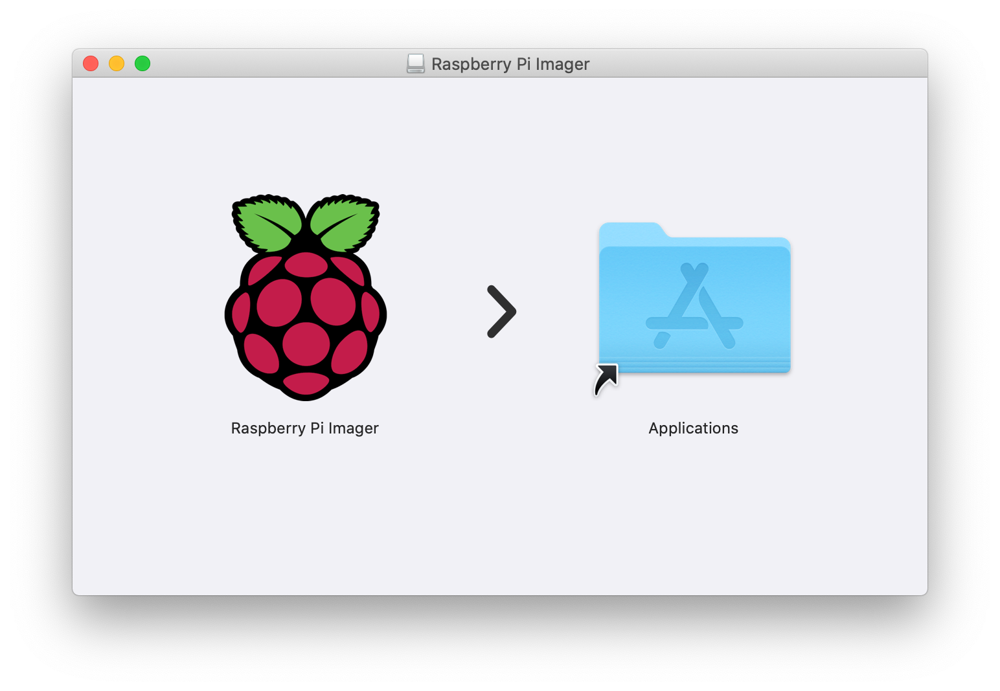
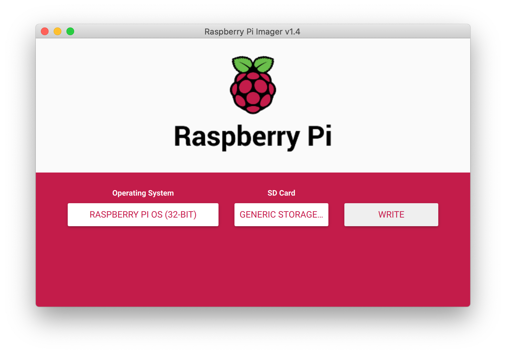
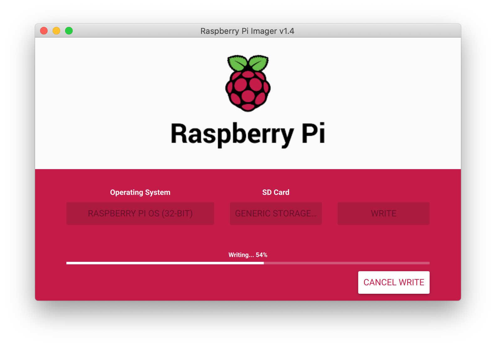
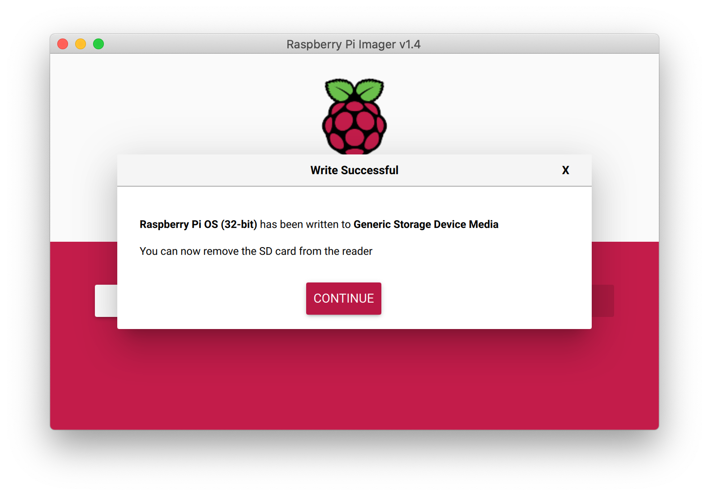

## Install Raspberry Pi OS using Raspberry Pi Imager

#### Download NOOBS
https://www.raspberrypi.org/software/

#### Install Raspberry Pi Imager in macOS

#### Write Raspberry Pi OS into SD Card using Raspberry Pi Imager
- Insert the SD card in your MacBookPro
- Open Raspberry Pi Imager.
- Select Raspberry Pi OS and SD Card, Click Write button to start writing OS in SD card. 

- Writing and Verifying...

- Remove the SD card from the reader after the Raspberry Pi OS is written to the SD card.

## Set up your Raspberry Pi
[Setting up your Raspberry Pi](https://projects.raspberrypi.org/en/projects/raspberry-pi-setting-up)

- Insert the microSD card into the card slot on the underside of the Raspberry Pi.
- Plug the USB keyboard into one of the USB ports.
- Plug the USB mouse into one of the USB ports
- Plug the HDMI or video component cable into the monitor or TV set. Turn on your monitor or TV set and make sure it is set to the proper input (e.g. HDMI 1 or Component)
- Connect USB WiFi Dongle or Ethernet Cable to the Raspberry Pi.
- Plug the power supply into the power outlet. This will turn on and boot up Raspberry Pi. 
- A start screen should appear on the monitor or TV you're using.
  - set up timezone
  - connect wifi network
  - upgrade OS
